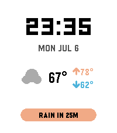
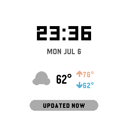
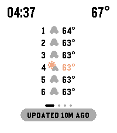

# TouchyWeather Face ⌚🌦️

**The TouchyWeather watch face** — a big-digital clock that hides a whole
weather deck behind a tap on the glass. Companion to the
[TouchyWeather](../TouchyWeather) watchapp; same design language, same
Open-Meteo pipeline, zero API keys.

## The face

At rest: big LECO time, date, animated condition icon, temperature with
hi/lo, and the signature bottom banner alternating `RAIN IN 15M` (orange) ⇄
`UPDATED 5M AGO` (muted).

**Nudge it** (flick your wrist, or firmly tap the glass/body — accelerometer
tap detection, no touchscreen needed) and the lower half pages through peek
cards: **6 Hours → Week Ahead → Conditions → Sun + Moon**, then back to the
clock. It also auto-returns after ~7 s. Gesture behavior is configurable
(Nudge Deck / Single peek overlay / Auto-rotate / Off).

## Customization (Clay)

- **Nudge input** — which motion drives the deck: **Wrist flick** (default),
  **Tap the watch**, or **Either**. Both come from the accelerometer (a
  watchface can't use the touchscreen); they're told apart by axis — a flick
  registers on X/Y, a tap on Z. Discrimination is approximate on real
  hardware, so *Either* is the reliable fallback.
- **Battery indicator** — Off / Always / Only when low. A small pill top-of-face,
  orange when low, with a charging bolt.
- **Complication** — one extra reading below the date: feels-like, wind,
  humidity, UV, air quality, or step count.
- Plus theme, forecast time format, gesture mode, peek-page toggles, ambient
  extras (rain auto-peek, night mode, UV badge, Quick View reflow), units,
  and location override.

## Interactions & the touch story

Watch faces on current Pebble firmware **cannot receive touch_service
events** (watchapp-only, per the SDK docs) and get no button clicks. So the
face is built around what faces *do* get:

- **Accel tap ("nudge")** — the deck driver
- **Time & data ticks** — banner alternation, auto-rotate mode
- **Ambient context** — rain-imminent auto-peek, night mode, UV badge
- **Quick View** — unobstructed-area-aware reflow

All touch gesture code (tap = nudge, swipe L/R = page nav, swipe up =
overlay, swipe down = dismiss/refresh) ships compiled-out behind
`ENABLE_TOUCH` in `src/c/gesture.c`, using the app's exact thresholds. The
day firmware delivers touch to faces, flip it to 1 and rebuild.

### Touch spike findings (2026-07-06, SDK 4.17 emulator, emery)

In a `watchface: true` build:

- `PBL_TOUCH` **is defined** for emery — touch code compiles into faces.
- `touch_service_is_enabled()` returned **true**.
- `touch_service_subscribe()` **succeeded** (no error, app runs normally).
- **Event delivery is unverified**: emulator touch input is not scriptable
  (`pebble emu-tap` is the accelerometer; `emu-control` is interactive-only),
  so whether `TouchEvent`s actually arrive in a face needs a manual test —
  set `TOUCH_SPIKE 1` in `src/c/gesture.c`, install on hardware (fw ≥ 5.92),
  tap the screen, and watch `pebble logs`.

## Screenshots

| emery (rest) | gabbro (rest) | emery (deck: 6 hours) |
|---|---|---|
|  |  |  |

All six platforms in `screenshots/` — basalt, chalk, diorite, emery, flint, gabbro.

## Build / run

```bash
pebble build
pebble install --emulator emery --vnc
pebble screenshot --emulator emery --vnc --no-open screenshot.png
pebble emu-tap --emulator emery --vnc   # simulate a nudge
```

Targets: basalt, chalk, diorite, emery, flint, gabbro.
