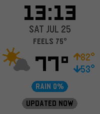
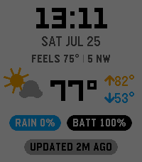
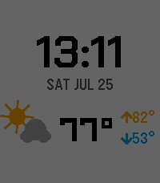
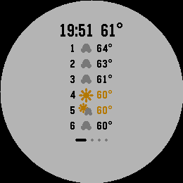
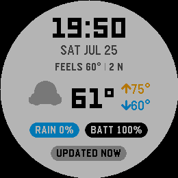
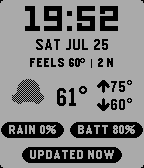

# TouchyWeather Face ⌚🌦️

**The TouchyWeather watch face** — a big-digital clock that hides a whole
weather deck behind a nudge of your wrist. Companion to the
[TouchyWeather](../TouchyWeather) watchapp; same design language, same
Open-Meteo pipeline, zero API keys.

## The face

The resting face is a **measured flow layout**, not a fixed template. Six rows —
time, date, complication lines, weather, badges, and the last-updated status —
are measured, stacked with elastic gaps, and centred as a group. Switch a row
off and the rest re-centre and the type *grows*; on a bare clock the digits
promote to a bundled XL numeral face.

| Out of the box | All four slots filled | Everything off |
|---|---|---|
|  |  |  |

Nothing is out-of-flow — there is no fixed chrome band reserving space at the
top or bottom, which is what keeps the face optically centred instead of
top-heavy.

### Complication slots

Four slots share one menu: **line 1** and **line 2** draw as text under the
date, **badge 1** and **badge 2** as coloured pills. Any slot can hold any of:

> feels like · wind · humidity · dew point · UV index · air quality ·
> rain chance · step count *(lines only)* · **watch battery**

Two readings on a line draw as one centred group split by a hairline rule
(`FEELS 75° | 5 NW`), each keeping its own accent colour. Each badge has an
opt-in **"only when notable"** filter, so a pill can stay hidden until it's
worth reading — rain ≥ 50%, UV ≥ 6 midday, battery ≤ 20% or charging.

No reading can sit in two slots at once: the phone pickers grey out an option
another slot already holds, and the watch de-duplicates at draw time, so
freeing the other slot brings the setting straight back.

**Watch battery** is the odd one out — watch state, not weather. It has no
always-on chrome; it draws only where you put it, and it ignores the staleness
gate the weather badges obey (a stale forecast says nothing about your charge).

### Status row

The bottom row reads `UPDATED 5M AGO`, and is configurable: **always** /
**only when stale** / **off**. An imminent-rain alert takes the row over in
every mode, alternating `RAIN IN 15M` (orange) ⇄ `UPDATED 5M AGO` (muted) —
even when the row is switched off.

## Nudge it

**Nudge** the watch — flick your wrist, or firmly tap the glass or body — and
the lower half deals a peek card: **6 Hours → Week Ahead → Conditions →
Sun + Moon**. It auto-returns to the clock after ~7 s, and the deck *resumes*:
the next nudge picks up after the last card you saw rather than restarting.

| Deck card | On round (gabbro) | 1-bit (diorite) |
|---|---|---|
|  |  |  |

Detection is accelerometer-only (a watch face gets no touchscreen and no
buttons — see below), so **Nudge input** picks which motion counts: wrist
flick, tap, or either. A flick registers on X/Y and a tap on Z; discrimination
is approximate on real hardware, so *Either* is the reliable fallback.

**What a nudge does** is configurable:

- **Nudge Deck** — page through your enabled peek pages, one per nudge
- **Single peek** — open one fixed view and close it on the next nudge. That's
  the dense everything-overlay by default, or any single page you pin.
- **Auto-rotate** — cycle the enabled pages on a timer, no nudging
- **Off** — clock only

The Peek Pages toggles feed the deck and auto-rotate; Single peek uses its own
pinned view instead, and draws no page dots — there is nowhere to page to.

## Customization (Clay)

The phone settings page carries a **live schematic of the resting face** that
reshapes as you change slots: boxes appear, disappear and re-centre, the clock
promotes, and conditional pills draw dashed. It follows your watch's actual
shape and colour depth.

Beyond the slots and gesture settings above: light/dark theme, animations,
units, forecast time format, dew point instead of humidity, a location
override, and the ambient extras — **rain auto-peek** (flashes the hourly page
when rain is due within the hour), **night mode** (dark theme plus moon phase
after sunset), and **Quick View reflow**.

## Interactions & the touch story

Watch faces on current Pebble firmware **cannot receive touch_service
events** (watchapp-only, per the SDK docs) and get no button clicks. So the
face is built around what faces *do* get:

- **Accel tap ("nudge")** — the deck driver
- **Time & data ticks** — banner alternation, auto-rotate mode
- **Ambient context** — rain-imminent auto-peek, night mode
- **Quick View** — unobstructed-area-aware reflow

All touch gesture code (tap = nudge, swipe L/R = page nav, swipe up =
overlay, swipe down = dismiss/refresh) ships compiled-out behind
`ENABLE_TOUCH` in `src/c/gesture.c`, using the app's exact thresholds. The
day firmware delivers touch to faces, flip it to 1 and rebuild.

### Touch spike findings (2026-07-06, SDK 4.17 emulator, emery)

In a `watchface: true` build:

- `PBL_TOUCH` **is defined** for emery — touch code compiles into faces.
- `touch_service_is_enabled()` returned **true**.
- `touch_service_subscribe()` **succeeded** (no error, app runs normally).
- **Event delivery is unverified**: emulator touch input is not scriptable
  (`pebble emu-tap` is the accelerometer; `emu-control` is interactive-only),
  so whether `TouchEvent`s actually arrive in a face needs a manual test —
  set `TOUCH_SPIKE 1` in `src/c/gesture.c`, install on hardware (fw ≥ 5.92),
  tap the screen, and watch `pebble logs`.

## Battery

At rest with no rain alert the face wakes **once per minute**, on the tick.
Every other timer is conditional and self-cancelling: the 10 Hz animation only
inside its 8 s window, the banner flip only during a rain alert, the idle
return only while a peek is open, auto-rotate only in that mode.

## Build / run

```bash
pebble build
pebble install --emulator emery --vnc
pebble emu-tap --emulator emery --vnc   # simulate a nudge

node tools/check-message-keys.js        # phone map vs watch header vs package.json
node tools/audit-settings.js            # every Clay item -> the C setter that runs it
```

Run both checks after any `messageKeys` edit — they are numbered by position,
so a stray insert silently shifts every setting into the next one's slot.

Targets: basalt, chalk, diorite, emery, flint, gabbro.
